# Azure Enterprise Architecture

## Entscheidung

Der Produktionspfad nutzt regionale Azure-OpenAI-Deployments mit SKU `Standard` in einer explizit erlaubten deutschen Azure-Region. Global- und Data-Zone-SKUs sind nicht Teil der IaC. Dokumentextraktion läuft über Azure AI Document Intelligence, Retrieval über Azure AI Search und Fachdaten über PostgreSQL Flexible Server.

Microsoft dokumentiert für Azure Direct Models, dass Prompts und Outputs nicht OpenAI bzw. anderen Modellprovidern zugänglich gemacht und nicht zum Training von Basismodellen verwendet werden; Abuse Monitoring und die konkrete Deploymentart bleiben dennoch in der instanzbezogenen Datenschutz-/Transferbewertung zu berücksichtigen. Quelle: [Azure Direct Models data, privacy and security](https://learn.microsoft.com/en-us/azure/foundry/responsible-ai/openai/data-privacy).

## Datenfluss

```mermaid
flowchart LR
    U["Entra-authentifizierter Nutzer"] --> W["Application Gateway WAF"]
    W --> A["Azure Container Apps / Easy Auth"]
    A --> P["PDF-Validierung"]
    P --> B["Private Blob Storage"]
    B --> M["Defender Malware Scan"]
    M -->|"No threats found"| D["Document Intelligence"]
    D --> E["Azure OpenAI Embeddings"]
    E --> S["AI Search / Tenant Filter"]
    U --> Q["Zweck- und Eingabe-Gate"]
    Q --> S
    S --> G["Regional Azure OpenAI Chat"]
    G --> C["Zitatvalidierung"]
    C --> R["PostgreSQL / FORCE RLS"]
    R --> H["Human Review"]
    H --> X["Rollenbegrenzter Export"]
    L["Täglicher Lifecycle Job"] --> B
    L --> S
    L --> R
```

## Sicherheitsgrenzen

- Application Gateway ist der öffentliche TLS-/WAF-Einstieg. Container Apps läuft in einer internen, VNet-integrierten Umgebung.
- Blob, Key Vault, Azure OpenAI, Document Intelligence, AI Search und ACR besitzen Private Endpoints und Private DNS.
- PostgreSQL ist per delegiertem Subnetz privat erreichbar; Geo-Backup ist bewusst deaktiviert, um die Regionsgrenze nicht implizit zu erweitern.
- Runtime-Zugriffe erfolgen über eine User Assigned Managed Identity. Azure-PaaS-Local-Auth ist deaktiviert; Produktionskonfiguration verbietet statische Azure-Service-Keys.
- Secrets liegen als Key-Vault-Referenzen in Container Apps. Der Applikationscontainer erhält nur das Datenbankpasswort und das HMAC-Pseudonymisierungsgeheimnis.
- Uploads werden vor Extraktion auf Typ, Größe, aktive PDF-Inhalte und nach Speicherung über Defender for Storage geprüft. Nur `No threats found` öffnet den Verarbeitungspfad. Microsoft beschreibt Private-Endpoint-Unterstützung und regionale Scanverarbeitung: [Defender for Storage malware scanning](https://learn.microsoft.com/en-us/azure/defender-for-cloud/introduction-malware-scanning).
- Search-Chunks enthalten `tenant_id`; jede Query und jede Löschung enthält einen serverseitig erzeugten, escaped Tenant-Filter. PostgreSQL erzwingt FORCE RLS auch auf der Tenant-Stammtabelle.
- Web-Runtime und Lifecycle-Job besitzen getrennte PostgreSQL-Loginrollen. Nur die Lifecycle-Rolle darf die SECURITY-DEFINER-Funktionen zur Tenant-Aufzählung und Fristlöschung ausführen; beide Rollen bleiben ohne DDL und allgemeines `DELETE`. Die Web-Rolle darf nur Dokumente, Assets und den Reviewstatus eines Analyselaufs aktualisieren; Reviews, Einwilligungsnachweise und Datenschutzanträge bleiben für sie append-only. Tabellen und Funktionen gehören einer nicht anmeldbaren `BYPASSRLS`-Ownerrolle, damit die Funktionen unter PostgreSQL 16 trotz FORCE RLS definiert und eng begrenzt arbeiten können; keine Anwendung erhält Mitgliedschaft in dieser Rolle.
- Rohfragen werden nicht geloggt; PostgreSQL speichert nur SHA-256 plus den resultierenden Entwurf und dessen Provenienz. Auditereignisse werden mandantenweise serialisiert und über eine domänensepariert abgeleitete HMAC-Kette authentisiert.

## Lieferkette

GitHub authentifiziert sich per OIDC ohne langlebiges Azure-Secret. Das Image wird in ACR gebaut, als Digest aufgelöst und nur immutable deployt. ACR-Public-Network-Access ist während des begrenzten `az acr build`-Schritts aktiviert und wird im Release-Deployment wieder deaktiviert. Microsoft dokumentiert, dass `az acr build` bei vollständig deaktiviertem Public Access ohne dedizierten Agent Pool fehlschlägt: [ACR Private Link und ACR Tasks](https://learn.microsoft.com/en-us/azure/container-registry/container-registry-private-endpoints). Ein dauerhaft privater Build erfordert als nächste Betriebsstufe einen dedizierten ACR Agent Pool oder einen VNet-gebundenen Self-hosted Runner.

CI erstellt ein CycloneDX-SBOM, scannt Quelltext, Dependencies und Container und blockiert bei High-/Critical-Containerfunden. Branch Protection und Environment Approvals müssen in GitHub organisatorisch aktiviert werden; `CODEOWNERS` allein erzwingt sie nicht.

## Verfügbarkeit und Recovery

- Container Apps: 2–10 Replikate.
- Application Gateway WAF v2: mindestens zwei Instanzen, zonenverteilt.
- Blob: ZRS und Infrastrukturverschlüsselung.
- PostgreSQL: zonenredundante Hochverfügbarkeit und 14 Tage Point-in-Time Backup.
- Search: drei Replikate; ein Partition. Kapazität ist vor Go-live zu testen.
- Log Analytics: 30 Tage technische Logs, ohne bewusste Rohinhalte.

Diese Einstellungen sind Architekturkonfiguration, keine SLA-Zusage. Lasttest, Chaos-/Failovertest und Restore-Drill sind Freigabenachweise.

## Offene externe Gates

1. Modellname und Version müssen in Germany West Central verfügbar und fachlich evaluiert sein.
2. DPA/AVV, Unterauftragsverarbeiter, Transferbewertung/TIA und Abuse-Monitoring-Entscheidung müssen freigegeben sein.
3. TLS-Zertifikat muss als Key-Vault-Certificate importiert und die Secret-ID gesetzt sein.
4. Entra-App-Rollen, Assignment Requirement, Conditional Access und Break-glass-Verfahren müssen im Tenant konfiguriert sein.
5. Security Operations müssen Defender Alerts, Azure Activity Logs, WAF und Container-Logs in den Incidentprozess integrieren.
6. Retention Policy, Verzeichnis der Verarbeitungstätigkeiten und DSR-Verantwortliche müssen dieselbe Evidence-ID verwenden wie das Runtime-Gate.
